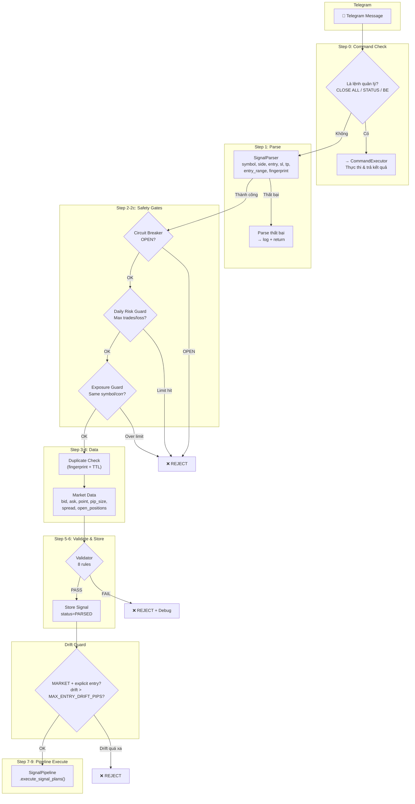
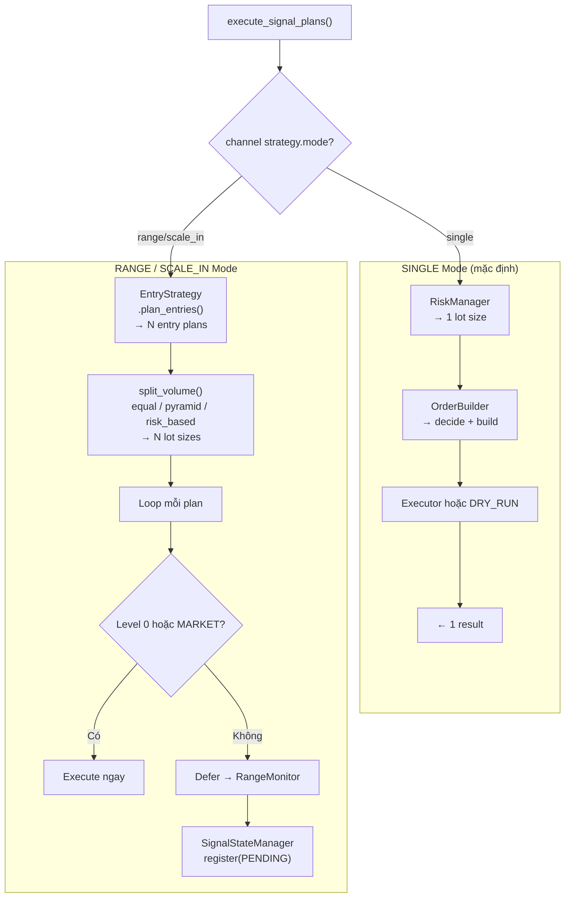
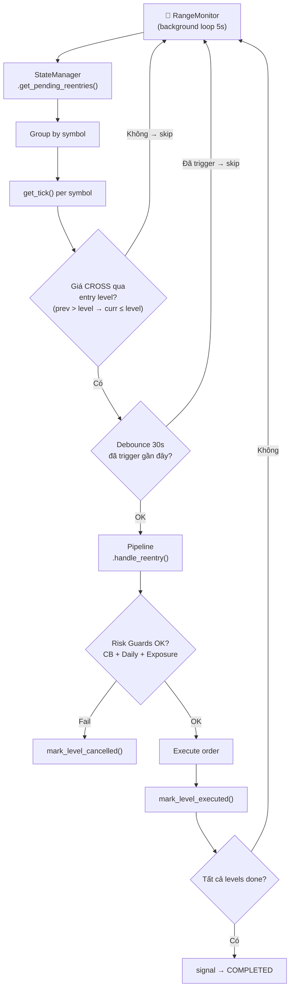
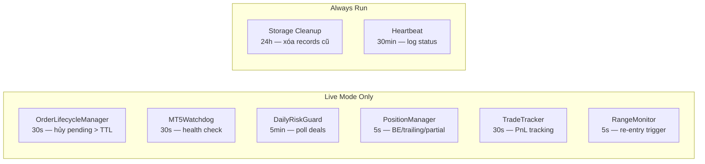

# 🔄 FLOW & SETUP GUIDE — telegram-mt5-bot v0.22.3

> Tài liệu gốc cho user: vẽ chi tiết luồng hoạt động, cấu hình thay đổi luồng, và hướng dẫn setup.

---

## 1. Tổng Quan Luồng Chạy



---

## 2. Luồng Bên Trong SignalPipeline



---

## 3. Luồng Re-Entry (RangeMonitor)



---

## 4. Background Tasks



---

## 5. CẤU HÌNH THAY ĐỔI LUỒNG CHẠY

### 5.1 `channels.json` — Thay đổi chiến lược per-channel

> File: `config/channels.json` (copy từ `channels.example.json`)

#### `strategy.mode` — **QUAN TRỌNG NHẤT**

| Giá trị | Luồng | Mô tả |
|---------|-------|-------|
| `"single"` (mặc định) | 1 signal → 1 order | Giống hệt trước P9. Không có re-entry. RangeMonitor không track. |
| `"range"` | 1 signal → N orders (chia trên entry_range) | Signal phải có `entry_range` (VD: BUY GOLD 2020-2030). Nếu không → fallback về single. Level 0 execute ngay, Level 1-N thành LIMIT orders chờ RangeMonitor trigger. |
| `"scale_in"` | 1 signal → N orders (stepped re-entry) | Entry → entry-step → entry-2×step. Cần config `reentry_step_pips > 0`. Nếu step=0 → fallback về single. |

#### `strategy.max_entries`

| Giá trị | Ảnh hưởng |
|---------|-----------|
| `1` | Luôn single dù mode=range/scale_in |
| `2-10` | Số order tối đa từ 1 signal |
| `> 10` | Hard cap ở 10 |

#### `strategy.volume_split`

| Giá trị | Phân bổ lot cho 0.06 ÷ 3 levels |
|---------|----------------------------------|
| `"equal"` | `[0.02, 0.02, 0.02]` — chia đều |
| `"pyramid"` | `[0.03, 0.02, 0.01]` — entry đầu lot lớn nhất |
| `"risk_based"` | Weighted theo khoảng cách SL. Level xa SL → lot lớn hơn (rủi ro/pip thấp hơn) |
| `"per_entry"` | Mỗi level nhận full `FIXED_LOT_SIZE`. VD: lot=0.01, 3 levels → mỗi level 0.01 (v0.19.0) |

#### `strategy.reentry_step_pips` (chỉ cho scale_in)

| Giá trị | Ảnh hưởng |
|---------|-----------|
| `0` | scale_in bị disable → fallback single |
| `20` | XAUUSD: step = 20 × 0.1 = $2.0. BUY entry=2030 → levels: 2030, 2028, 2026 |
| `10` | EURUSD: step = 10 × 0.0001 = 0.001. SELL entry=1.0850 → levels: 1.085, 1.086, 1.087 |

#### Các key bổ sung trong `strategy` (v0.19.0–v0.22.1)

| Field | Default | Ảnh hưởng |
|-------|---------|-----------|
| `min_sl_distance_pips` | `0` (disabled) | Skip order nếu giá quá gần SL |
| `default_sl_pips_from_zone` | `0` (disabled) | Tự tạo SL từ zone khi signal không có SL |
| `max_sl_distance_pips` | `0` (disabled) | Cap SL khi signal SL quá xa entry |
| `sl_buffer_pips` | `0` (disabled) | Nới rộng SL thêm N pips tránh spike (chỉ cho SL gốc từ signal) |
| `reentry_tolerance_pips` | `0` (exact) | Cho phép re-entry trigger trong khoảng N pips |
| `max_reentry_distance_pips` | `0` (disabled) | Skip re-entry nếu giá quá xa level |
| `execute_all_immediately` | `false` | `true` → tất cả levels đặt LIMIT/STOP ngay lập tức (không dùng RangeMonitor) |

#### `strategy.signal_ttl_minutes`

| Giá trị | Ảnh hưởng |
|---------|-----------|
| `15` (mặc định) | Signal hết hạn sau 15 phút → remaining levels → EXPIRED, ngừng monitor |
| `60` | Cho phép re-entry trong 1 giờ |

#### `rules` — Position Management

| Field | Default | Ảnh hưởng |
|-------|---------|-----------|
| `breakeven_trigger_pips` | `0` (disabled) | Profit bao nhiêu pip → SL chuyển về entry + lock_pips |
| `breakeven_lock_pips` | `2` | Khi breakeven trigger, SL = entry + lock_pips |
| `trailing_stop_pips` | `0` (disabled) | SL tự động theo giá với khoảng cách trail |
| `partial_close_percent` | `0` (disabled) | Đóng N% volume khi giá chạm vùng TP |
| `group_trailing_pips` | `0` (disabled) | Group trailing SL — trail cả nhóm order theo giá (v0.10.0) |
| `group_be_on_partial_close` | `true` | Tự set BE cho remaining orders khi partial close trong group |
| `reply_close_strategy` | `"highest_entry"` | Strategy khi reply "close": `highest_entry`, `lowest_entry`, `oldest` (v0.10.0) |
| `secure_profit_action` | `"close_worst_be_rest"` | Reply "+N pip": đóng worst entry + BE rest (v0.19.0) |
| `reply_be_lock_pips` | `1` | Reply "be" sets SL = entry ± N pip thay vì exact entry (v0.19.0) |
| `sl_mode` | `"signal"` | Nguồn SL cho group: `signal`, `zone`, `fixed` (v0.10.0) |
| `sl_max_pips_from_zone` | `0` | Max SL distance từ zone (chỉ cho sl_mode=zone) |
| `order_types_allowed` | `["MARKET","LIMIT","STOP"]` | Cho phép loại order nào. Loại STOP → fallback MARKET/LIMIT |

#### `risk` — Per-Channel Risk Override

| Field | Global env | Ảnh hưởng |
|-------|------------|-----------|
| `mode` | `RISK_MODE` | `FIXED_LOT` hoặc `RISK_PERCENT` |
| `fixed_lot_size` | `FIXED_LOT_SIZE` | Lot cố định per order (trước split) |
| `risk_percent` | `RISK_PERCENT` | % balance per trade |

#### `validation` — Per-Channel Validation Override

| Field | Global env | Ảnh hưởng |
|-------|------------|-----------|
| `max_entry_distance_pips` | `MAX_ENTRY_DISTANCE_PIPS` | Khoảng cách entry cho phép |
| `max_entry_drift_pips` | `MAX_ENTRY_DRIFT_PIPS` | Drift guard cho MARKET |
| `max_spread_pips` | `MAX_SPREAD_PIPS` | Spread tối đa cho phép |

---

### 5.2 `.env` — Biến Môi Trường Ảnh Hưởng Luồng

#### 🔴 Thay Đổi Trực Tiếp Luồng Chạy

| ENV | Default | Thay đổi luồng |
|-----|---------|----------------|
| `DRY_RUN` | `false` | `true` → **không gửi lệnh thật**. Pipeline vẫn chạy đầy đủ nhưng simulate kết quả. RangeMonitor vẫn chạy. Balance = 10000. |
| `CIRCUIT_BREAKER_THRESHOLD` | `3` | Sau N lần execute fail liên tiếp → **tạm dừng toàn bộ trading**. Cả signal mới và re-entry bị block. |
| `MAX_OPEN_TRADES` | `5` | Reject signal nếu đã có N positions mở. **Re-entry cũng bị đếm.** |
| `MAX_DAILY_TRADES` | `0` (disabled) | Max trades/ngày. `0` = unlimited. **Mỗi re-entry order ĐỀU đếm.** |
| `MAX_DAILY_LOSS` | `0` (disabled) | Max loss USD/ngày. Vượt → **tạm dừng cả signal mới và re-entry.** |
| `MAX_SAME_SYMBOL_TRADES` | `0` (disabled) | Max positions cùng symbol. VD: đã có 2 XAUUSD → reject signal XAUUSD mới. |
| `DEBUG_SIGNAL_DECISION` | `false` | `true` → gửi debug message về Telegram admin mỗi signal (raw + parsed + decision). |

#### 🟡 Thay Đổi Logic Xử Lý

| ENV | Default | Ảnh hưởng |
|-----|---------|-----------|
| `RISK_MODE` | `FIXED_LOT` | `RISK_PERCENT` → lot size thay đổi theo balance. Total volume → chia cho N levels nếu multi-order. |
| `FIXED_LOT_SIZE` | `0.01` | Lot cố định. Với range 3 levels, equal split → mỗi level 0.01/3 ≈ 0.01 (lot_min). |
| `MAX_ENTRY_DISTANCE_PIPS` | `50.0` | Reject nếu entry xa giá hiện tại > 50 pips. Tăng → chấp nhận signal "cũ" hơn. |
| `MAX_ENTRY_DRIFT_PIPS` | `10.0` | **Chỉ cho MARKET order.** Nếu signal có entry=2935, giá đã 2937 → drift=20 pips > 10 → REJECT. |
| `MAX_SPREAD_PIPS` | `5.0` | ⚠️ **Hiện tại đang bị comment out trong code.** Signal sẽ KHÔNG bị reject bởi spread. |
| `MARKET_TOLERANCE_POINTS` | `5.0` | Nếu `|entry - price| ≤ tolerance × point` → order = MARKET thay vì LIMIT. XAUUSD: 5 × 0.01 = $0.05. |
| `DEVIATION_POINTS` | `20` | Max slippage cho MARKET orders. |
| `PENDING_ORDER_TTL_MINUTES` | `15` | Tự hủy pending order (LIMIT/STOP) sau 15 phút. **Áp dụng cho cả multi-order.** |
| `SIGNAL_AGE_TTL_SECONDS` | `60` | Signal cũ hơn 60s → reject + cũng là dedup window. |

#### 🟢 Không Thay Đổi Luồng (nhưng ảnh hưởng hành vi)

| ENV | Default | Ghi chú |
|-----|---------|---------|
| `ALERT_COOLDOWN_SECONDS` | `300` | Rate limit Telegram alerts. Debug messages bypass rate limit. |
| `HEARTBEAT_INTERVAL_MINUTES` | `30` | Status log mỗi 30 phút. `0` = disabled. |
| `STORAGE_RETENTION_DAYS` | `30` | Tự xóa records cũ hơn 30 ngày. |
| `SESSION_RESET_HOURS` | `12` | Tự reset Telethon session mỗi 12h. |

---

## 6. HƯỚNG DẪN SETUP CHI TIẾT

### 6.1 Bước 1: Chuẩn Bị Môi Trường

```bash
# Clone repo
git clone <repo_url>
cd Forex

# Tạo virtual environment
python -m venv venv
venv\Scripts\activate  # Windows
# source venv/bin/activate  # Linux/Mac

# Cài dependencies
pip install -r requirements.txt
```

### 6.2 Bước 2: Cấu Hình `.env`

```bash
cp .env.example .env
```

Mở `.env` và điền:

```ini
# BẮT BUỘC
TELEGRAM_API_ID=12345678
TELEGRAM_API_HASH=abcdef1234567890abcdef
TELEGRAM_PHONE=+84327279393
TELEGRAM_SOURCE_CHATS=-1001234567890,-1009876543210  # channel IDs
TELEGRAM_ADMIN_CHAT=-1001111111111                   # admin group

MT5_PATH=C:\Program Files\MetaTrader 5\terminal64.exe
MT5_LOGIN=12345678
MT5_PASSWORD=YourPassword123
MT5_SERVER=ExnessDemoServer

# KHUYẾN NGHỊ MẶC ĐỊNH CHO NGƯỜI MỚI
DRY_RUN=true              # Bật dry-run trước!
RISK_MODE=FIXED_LOT
FIXED_LOT_SIZE=0.01
MAX_OPEN_TRADES=5
CIRCUIT_BREAKER_THRESHOLD=3
DEBUG_SIGNAL_DECISION=true # Xem debug message trên Telegram
```

### 6.3 Bước 3: Cấu Hình Channels (Tùy Chọn)

```bash
cp config/channels.example.json config/channels.json
```

#### Cấu hình 1: Single Mode (mặc định, an toàn nhất)

```json
{
    "default": {
        "name": "Global Defaults",
        "rules": {
            "breakeven_trigger_pips": 0,
            "trailing_stop_pips": 0,
            "partial_close_percent": 0
        },
        "strategy": {
            "mode": "single",
            "max_entries": 1
        }
    },
    "channels": {}
}
```

→ **Mọi channel → 1 signal = 1 order. Không re-entry.**

#### Cấu hình 2: Range Mode Cho Channel Cụ Thể

```json
{
    "default": {
        "strategy": { "mode": "single" }
    },
    "channels": {
        "-1001234567890": {
            "name": "Gold Signals VIP",
            "strategy": {
                "mode": "range",
                "max_entries": 3,
                "volume_split": "equal",
                "signal_ttl_minutes": 60
            },
            "rules": {
                "breakeven_trigger_pips": 50,
                "breakeven_lock_pips": 30,
                "trailing_stop_pips": 40
            }
        }
    }
}
```

→ **Channel -1001234567890**: Signal có range → 3 orders chia đều. Re-entry 60 phút.
→ **Các channel khác**: Single mode.

#### Cấu hình 3: Scale-In Mode

```json
{
    "channels": {
        "-1009876543210": {
            "name": "Forex Scalper",
            "strategy": {
                "mode": "scale_in",
                "max_entries": 3,
                "reentry_step_pips": 10,
                "volume_split": "pyramid",
                "signal_ttl_minutes": 30
            }
        }
    }
}
```

→ BUY EURUSD 1.0850: orders tại 1.0850, 1.0840, 1.0830 (mỗi level cách nhau 10 pips).
→ Pyramid split: lot đầu lớn nhất, nhỏ dần.

### 6.4 Bước 4: Chạy Bot

```bash
# DRY RUN đầu tiên — LUÔN test trước!
DRY_RUN=true
python run.py bot  # hoặc: venv\Scripts\python.exe main.py

# Bạn sẽ thấy:
# =======================================================
#   telegram-mt5-bot  v0.22.3  [DRY RUN]
# =======================================================
#   Risk mode    : RISK_MODE.FIXED_LOT
#   Max spread   : 5.0 pips
#   ...
# =======================================================
# [INFO] Bot is running. Ctrl+C to stop.
```

### 6.5 Bước 5: Kiểm Tra Output

Khi nhận signal, terminal sẽ hiển thị:

**Single mode:**
```
  [PIPELINE] fp=abc123 symbol=XAUUSD order=MARKET exec=DRY_RUN_OK vol=0.01 level=0
  [PIPELINE] fp=abc123 total_orders=1 latency=5ms
```

**Range mode (3 levels):**
```
  [PIPELINE] fp=abc123:L0 symbol=XAUUSD order=BUY_LIMIT exec=DRY_RUN_OK vol=0.02 level=0
  [PIPELINE] fp=abc123 total_orders=1 latency=8ms
```
_(Level 1, 2 là deferred — sẽ được RangeMonitor trigger khi giá cross)_

### 6.6 Bước 6: Chuyển LIVE

```bash
# Khi đã hài lòng với dry-run:
DRY_RUN=false

# Khuyến nghị safety settings cho live:
MAX_OPEN_TRADES=3
CIRCUIT_BREAKER_THRESHOLD=3
MAX_DAILY_TRADES=10
MAX_DAILY_LOSS=100.0            # USD
MAX_CONSECUTIVE_LOSSES=3
DEBUG_SIGNAL_DECISION=true      # Giữ debug để monitor
```

---

## 7. BẢNG QUYẾT ĐỊNH NHANH

| Tôi muốn... | Config cần đổi | File |
|-------------|----------------|------|
| 1 signal = 1 order | `strategy.mode: "single"` | channels.json |
| 1 signal = nhiều order từ range | `strategy.mode: "range"`, `max_entries: 3` | channels.json |
| Tự động mua thêm khi giá giảm | `strategy.mode: "scale_in"`, `reentry_step_pips: 20` | channels.json |
| Lot lớn ở entry đầu, nhỏ ở sau | `strategy.volume_split: "pyramid"` | channels.json |
| Mỗi entry nhận full lot size | `strategy.volume_split: "per_entry"` | channels.json |
| Tự chuyển SL khi có lãi | `rules.breakeven_trigger_pips: 50` | channels.json |
| Trailing stop | `rules.trailing_stop_pips: 40` | channels.json |
| Tự tạo SL khi signal không có | `strategy.default_sl_pips_from_zone: 30` | channels.json |
| Chặn SL quá xa | `strategy.max_sl_distance_pips: 100` | channels.json |
| Nới rộng SL tránh spike | `strategy.sl_buffer_pips: 3` | channels.json |
| Reply +pip đóng worst + BE rest | `rules.secure_profit_action: "close_worst_be_rest"` | channels.json |
| Dừng trading sau 3 lần thua liên tiếp | `MAX_CONSECUTIVE_LOSSES=3` | .env |
| Dừng trading sau $100 loss/ngày | `MAX_DAILY_LOSS=100.0` | .env |
| Chỉ cho phép 2 GOLD order mở | `MAX_SAME_SYMBOL_TRADES=2` | .env |
| Test không vào lệnh thật | `DRY_RUN=true` | .env |
| Xem chi tiết từng signal trên TG | `DEBUG_SIGNAL_DECISION=true` | .env |

---

## 8. SƠ ĐỒ FILE VÀ CONFIG

```
Forex/
├── main.py                     # Bot orchestration (Bot class)
├── run.py                      # Unified launcher (bot/dash/v2/combo)
├── .env                        # Environment variables (BẮT BUỘC)
├── .env.example                # Template
├── config/
│   ├── channels.json           # Per-channel strategy (TÙY CHỌN)
│   ├── channels.example.json   # Template
│   └── settings.py             # Load .env → Settings object
├── core/
│   ├── models.py               # Data contracts: ParsedSignal, EntryPlan, OrderGroup
│   ├── pipeline.py             # SignalPipeline — sole orchestrator
│   ├── entry_strategy.py       # Plan entries + split volume
│   ├── signal_state_manager.py # PENDING→PARTIAL→COMPLETED
│   ├── range_monitor.py        # Background re-entry trigger
│   ├── position_manager.py     # BE/trailing/partial/group management
│   ├── health.py               # HealthStats + HTTP /health server
│   ├── circuit_breaker.py      # Circuit breaker state machine
│   ├── telegram_alerter.py     # Rate-limited Telegram alerts
│   ├── signal_parser/          # Parse Telegram → ParsedSignal
│   ├── signal_validator.py     # 8 validation rules
│   ├── risk_manager.py         # Volume calculation
│   ├── order_builder.py        # MARKET/LIMIT/STOP decision
│   ├── trade_executor.py       # MT5 order_send with retry
│   ├── trade_tracker.py        # Background PnL tracking
│   ├── channel_manager.py      # Load channels.json
│   ├── storage.py              # SQLite persistence (V1–V7 migrations)
│   └── ...                     # (xem ARCHITECTURE.md)
├── utils/
│   ├── symbol_mapper.py        # Symbol alias + pip size helper
│   └── logger.py               # Loguru config
├── dashboard/
│   ├── dashboard.py            # FastAPI app (V1 + API backend)
│   ├── api/routes.py           # 20 REST endpoints
│   └── db/queries.py           # DashboardDB SQL queries
├── dashboard-v2/               # React SPA (Vite + Recharts)
├── data/
│   └── bot.db                  # SQLite database
└── logs/
    └── bot.log                 # Structured JSON logs
```

---

## 9. FAQ — Câu Hỏi Thường Gặp

**Q: Tôi set `mode: "range"` nhưng signal chỉ vào 1 order?**
A: Signal phải có `entry_range` (VD: "BUY GOLD 2020-2030"). Nếu parser không detect range → fallback về single. Kiểm tra log `[PIPELINE]` → `entry_strategy_planned plans_count=1`.

**Q: RangeMonitor có chạy trong dry-run không?**
A: RangeMonitor chỉ chạy ở **live mode** (DRY_RUN=false). Trong dry-run, Level 0 execute ngay, các levels khác được log nhưng không monitor.

**Q: Tôi muốn test multi-order mà không rủi ro?**
A: Set `DRY_RUN=true` + `mode: "range"` + `DEBUG_SIGNAL_DECISION=true`. Gửi signal có range → xem terminal + Telegram debug.

**Q: Làm sao biết channel ID của mình?**
A: Gửi tin nhắn trong channel → xem log bot: `[SIGNAL] chat_id=...`. Hoặc dùng Telegram API/Bot.

**Q: Tôi thay đổi channels.json có cần restart bot không?**
A: **Có.** ChannelManager load file 1 lần khi startup. Phải restart bot để apply.
