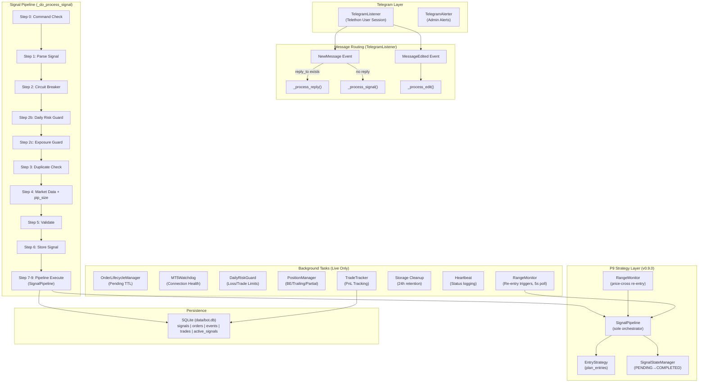
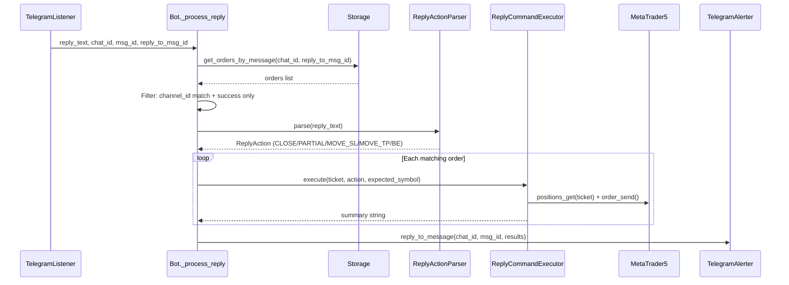
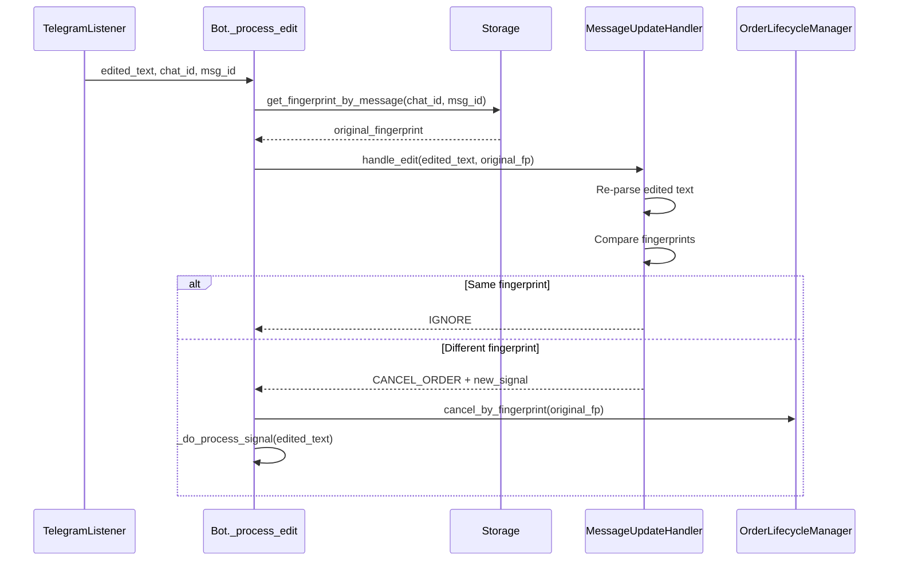
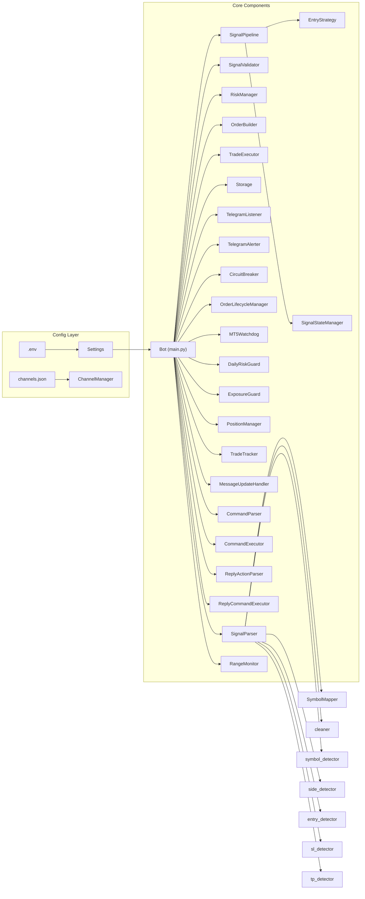

# 📊 Phân Tích Luồng Chạy — telegram-mt5-bot v0.9.0

> Full codebase analysis: 20+ modules, ~5500 lines of production code.

---

## 1. Architecture Overview



---

## 2. Startup Sequence

| Step | Code Location | Description |
|------|---------------|-------------|
| 1 | [main()](file:///d:/Development/Workspace/Python_Projects/Forex/main.py#1378-1382) → [Bot().run()](file:///d:/Development/Workspace/Python_Projects/Forex/main.py#92-1376) | Entry point tạo Bot instance |
| 2 | [_init_components()](file:///d:/Development/Workspace/Python_Projects/Forex/main.py#133-302) | Wire tất cả 20+ components từ [.env](file:///d:/Development/Workspace/Python_Projects/Forex/.env) settings |
| 3 | `executor.init_mt5()` | Connect & login MT5 (skip nếu dry-run) |
| 4 | Banner print | In config summary ra console |
| 5 | [_sync_positions_on_startup()](file:///d:/Development/Workspace/Python_Projects/Forex/main.py#1190-1217) | Log audit vị thế MT5 hiện tại (live only) |
| 6 | `listener.start()` | Kết nối Telegram, subscribe source chats |
| 7 | Share Telethon client | `alerter.set_client(listener.client)` |
| 8 | Start backgrounds | lifecycle, watchdog, daily_guard, position_mgr, trade_tracker |
| 9 | Start heartbeat + cleanup | [_heartbeat_loop()](file:///d:/Development/Workspace/Python_Projects/Forex/main.py#1085-1103), [_storage_cleanup_loop()](file:///d:/Development/Workspace/Python_Projects/Forex/main.py#1070-1084) |
| 10 | `listener.run_until_disconnected()` | Block main loop, auto-reconnect |

---

## 3. Signal Pipeline — Chi Tiết Từng Bước

### Step 0: Command Check
- **File**: [command_parser.py](file:///d:/Development/Workspace/Python_Projects/Forex/core/command_parser.py)
- Message được check trước xem có phải management command không
- Supported: `CLOSE ALL`, `CLOSE <SYMBOL>`, `CLOSE HALF`, `MOVE SL <PRICE>`, `BREAKEVEN`
- Nếu match → execute ngay qua [CommandExecutor](file:///d:/Development/Workspace/Python_Projects/Forex/core/command_executor.py#20-302) → return (không vào signal pipeline)

### Step 1: Parse Signal
- **File**: [parser.py](file:///d:/Development/Workspace/Python_Projects/Forex/core/signal_parser/parser.py)
- Clean text → detect symbol → detect side → detect entry → detect SL → detect TPs
- Output: [ParsedSignal](file:///d:/Development/Workspace/Python_Projects/Forex/core/models.py#36-53) hoặc [ParseFailure](file:///d:/Development/Workspace/Python_Projects/Forex/core/models.py#55-64)
- Fingerprint = SHA-256(chat_id + symbol + side + entry + sl + tps)[:16]
- Nếu fail → log event, store event, send debug → return

### Step 2: Circuit Breaker Check
- **File**: [circuit_breaker.py](file:///d:/Development/Workspace/Python_Projects/Forex/core/circuit_breaker.py)
- Pattern: CLOSED → OPEN → HALF_OPEN → CLOSED
- OPEN sau N consecutive execution failures
- Auto-recovery sau cooldown seconds
- Nếu OPEN → reject signal

### Step 2b: Daily Risk Guard
- **File**: [daily_risk_guard.py](file:///d:/Development/Workspace/Python_Projects/Forex/core/daily_risk_guard.py)
- Poll MT5 deal history mỗi N phút
- 3 limits: max_daily_trades, max_daily_loss_usd, max_consecutive_losses
- Reset at UTC midnight
- Live mode only

### Step 2c: Exposure Guard
- **File**: [exposure_guard.py](file:///d:/Development/Workspace/Python_Projects/Forex/core/exposure_guard.py)
- Query live MT5 positions (không cache → always fresh)
- Check same-symbol limit + correlation group limit
- Live mode only

### Step 3: Duplicate Check
- **File**: [storage.py](file:///d:/Development/Workspace/Python_Projects/Forex/core/storage.py) → [is_duplicate()](file:///d:/Development/Workspace/Python_Projects/Forex/core/storage.py#262-281)
- SQLite query: fingerprint exists within TTL window
- Fingerprint includes `source_chat_id` → dedup per channel

### Step 4: Market Data Resolution
- Live: `executor.get_tick()` → bid, ask, spread_points
- Live: `mt5.symbol_info()` → point, digits → pip_size
- Dry-run: [_simulate_tick()](file:///d:/Development/Workspace/Python_Projects/Forex/main.py#416-456) → synthetic bid/ask from signal entry
- pip_size = point × 10 (both 5-digit forex and 2-digit metals)

### Step 5: Validate
- **File**: [signal_validator.py](file:///d:/Development/Workspace/Python_Projects/Forex/core/signal_validator.py)
- Rule chain (first-reject-wins):
  1. Required fields (symbol, side, SL)
  2. Duplicate filter
  3. SL coherence (BUY: SL < entry, SELL: SL > entry)
  4. TP coherence
  5. Entry distance from live price (pips)
  6. Signal age TTL
  7. ~~Spread gate~~ (commented out)
  8. Max open trades gate

### Step 6: Store Signal
- `storage.store_signal(signal, PARSED)` → SQLite

### Step 7: Calculate Volume
- **File**: [risk_manager.py](file:///d:/Development/Workspace/Python_Projects/Forex/core/risk_manager.py)
- Mode `FIXED_LOT`: return fixed lot
- Mode `RISK_PERCENT`: `risk_amount / (sl_distance × pip_value)`
- Clamp to lot_min/lot_max, round to lot_step

### Step 8: Build Order
- **File**: [order_builder.py](file:///d:/Development/Workspace/Python_Projects/Forex/core/order_builder.py)
- Decision matrix:

| Side | Entry vs Price | Order Type |
|------|---------------|------------|
| BUY | entry is None | MARKET |
| BUY | \|entry - ask\| ≤ tolerance | MARKET |
| BUY | entry < ask | BUY_LIMIT |
| BUY | entry > ask | BUY_STOP |
| SELL | entry is None | MARKET |
| SELL | \|entry - bid\| ≤ tolerance | MARKET |
| SELL | entry > bid | SELL_LIMIT |
| SELL | entry < bid | SELL_STOP |

- Build MT5 request dict với deviation, magic, filling type

### Step 8b: Entry Drift Guard
- Chỉ cho MARKET orders có explicit entry
- Reject nếu |entry - current_price| > max_entry_drift_pips
- Bảo vệ khỏi execute ở giá quá xa signal

### Step 9: Execute
- **Dry-run**: simulate, log, update status → EXECUTED
- **Live**: `executor.execute(request)` với bounded retry
  - Success codes: 10008, 10009, 10010
  - Retryable codes: 10004, 10020, 10021, 10024, 10031
  - Non-retryable: return FAILED immediately
  - Max retries exhausted → FAILED
- On success: store_order, register_ticket (for PositionManager), record_latency
- On failure: circuit_breaker.record_failure(), store as FAILED

---

## 4. Reply Handler Flow



**Supported reply actions**: [close](file:///d:/Development/Workspace/Python_Projects/Forex/core/storage.py#219-222), `close N%`, `SL <price>`, `TP <price>`, `BE/breakeven`

---

## 5. Edit Handler Flow



---

## 6. Background Tasks (Live Mode Only)

| Task | Class | Poll | Function |
|------|-------|------|----------|
| **Order Lifecycle** | [OrderLifecycleManager](file:///d:/Development/Workspace/Python_Projects/Forex/core/order_lifecycle_manager.py#18-133) | 30s | Cancel pending orders > TTL |
| **MT5 Watchdog** | [MT5Watchdog](file:///d:/Development/Workspace/Python_Projects/Forex/core/mt5_watchdog.py#18-161) | 30s | Health check, auto-reinit (exp. backoff) |
| **Daily Risk Guard** | [DailyRiskGuard](file:///d:/Development/Workspace/Python_Projects/Forex/core/daily_risk_guard.py#36-291) | 5min | Poll MT5 deals, enforce daily limits |
| **Position Manager** | [PositionManager](file:///d:/Development/Workspace/Python_Projects/Forex/core/position_manager.py#30-471) | 5s | Breakeven, trailing stop, partial close |
| **Trade Tracker** | [TradeTracker](file:///d:/Development/Workspace/Python_Projects/Forex/core/trade_tracker.py#31-379) | 30s | Poll deals, record PnL, reply to signals |
| **Range Monitor** | [RangeMonitor](file:///d:/Development/Workspace/Python_Projects/Forex/core/range_monitor.py) | 5s | Price-cross re-entry trigger, debounce 30s (v0.9.0) |
| **Storage Cleanup** | Bot._storage_cleanup_loop | 24h | Delete records > retention_days |
| **Heartbeat** | Bot._heartbeat_loop | 30min | Log rich system status |

### Position Manager Rules (per-channel via channels.json):
- **Breakeven**: SL → entry + lock_pips khi profit ≥ trigger_pips
- **Trailing**: SL follows price at trail_pips distance (only moves up/down)
- **Partial close**: Close N% volume khi price reaches TP zone

### Trade Tracker:
- Poll `mt5.history_deals_get()` for DEAL_ENTRY_OUT + DEAL_ENTRY_IN
- **DEAL_ENTRY_OUT** → record trade, send PnL reply to original signal message
- **DEAL_ENTRY_IN** → update [position_ticket](file:///d:/Development/Workspace/Python_Projects/Forex/core/storage.py#319-331) for pending fills
- Reply suppression for tickets closed via reply command (5min TTL)
- Partial close reply throttle (60s cooldown)

---

## 7. Data Model & Persistence

### SQLite Schema (data/bot.db)

| Table | Purpose | Key Columns |
|-------|---------|-------------|
| `signals` | Parse results | fingerprint, symbol, side, entry, sl, tp, status |
| [orders](file:///d:/Development/Workspace/Python_Projects/Forex/core/trade_executor.py#221-225) | Execution results | ticket, fingerprint, order_kind, retcode, channel_id |
| `events` | Lifecycle events | fingerprint, event_type, details (JSON) |
| [trades](file:///d:/Development/Workspace/Python_Projects/Forex/core/signal_validator.py#165-173) | Trade outcomes | ticket, deal_ticket (UNIQUE), pnl, close_reason |
| [tracker_state](file:///d:/Development/Workspace/Python_Projects/Forex/core/storage.py#489-496) | Worker state | key-value (last_deal_poll_time) |
| `schema_versions` | Migration history | version, applied_at |
| `active_signals` | Multi-order signal lifecycle state (v0.9.0) | fingerprint, status, plans (JSON), expires_at |

### Migration System:
- V1: Multi-channel columns (channel_id, source_chat_id, source_message_id, position_ticket)
- V2: [trades](file:///d:/Development/Workspace/Python_Projects/Forex/core/signal_validator.py#165-173) table + [tracker_state](file:///d:/Development/Workspace/Python_Projects/Forex/core/storage.py#489-496) table

---

## 8. Component Dependency Graph



---

## 9. Folder Structure

```
d:\Development\Workspace\Python_Projects\Forex\
├── main.py                     # Bot orchestration (1386 lines)
├── config/
│   ├── settings.py             # .env loader, typed config
│   ├── channels.json           # Per-channel rules
│   └── channels.example.json
├── core/
│   ├── models.py               # ParsedSignal, TradeDecision, etc.
│   ├── telegram_listener.py    # Telethon event handling
│   ├── telegram_alerter.py     # Admin alerts (rate-limited)
│   ├── signal_parser/
│   │   ├── parser.py           # Orchestrator
│   │   ├── cleaner.py          # Text normalization
│   │   ├── symbol_detector.py  # Symbol extraction
│   │   ├── side_detector.py    # BUY/SELL detection
│   │   ├── entry_detector.py   # Entry price extraction
│   │   ├── sl_detector.py      # Stop Loss extraction
│   │   └── tp_detector.py      # Take Profit extraction
│   ├── signal_validator.py     # Safety rules, coherence
│   ├── risk_manager.py         # Volume calculation
│   ├── order_builder.py        # MT5 request construction
│   ├── trade_executor.py       # MT5 connection + execution
│   ├── storage.py              # SQLite persistence
│   ├── circuit_breaker.py      # Failure protection
│   ├── order_lifecycle_manager.py  # Pending order TTL
│   ├── mt5_watchdog.py         # Connection health
│   ├── daily_risk_guard.py     # Daily limits
│   ├── exposure_guard.py       # Symbol concentration
│   ├── position_manager.py     # BE/Trailing/Partial
│   ├── trade_tracker.py        # PnL tracking + replies
│   ├── channel_manager.py      # Per-channel config
│   ├── message_update_handler.py   # Edit detection
│   ├── command_parser.py       # Management commands
│   ├── command_executor.py     # Command execution
│   ├── reply_action_parser.py  # Reply parsing
│   ├── reply_command_executor.py   # Reply execution
│   ├── entry_strategy.py       # Multi-entry plan engine (v0.9.0)
│   ├── signal_state_manager.py # Signal lifecycle state machine (v0.9.0)
│   ├── pipeline.py             # Sole execution orchestrator (v0.9.0)
│   └── range_monitor.py        # Price-cross re-entry monitor (v0.9.0)
├── utils/
│   ├── logger.py               # Structured logging
│   └── symbol_mapper.py        # Alias → broker symbol
├── data/
│   └── bot.db                  # SQLite database
├── docs/                       # Documentation
├── tools/                      # CLI tools
└── deploy/                     # Deployment configs
```

---

## 10. Potential Issues & Observations

> [!WARNING]
> **Spread gate đã bị comment out** trong [signal_validator.py](file:///d:/Development/Workspace/Python_Projects/Forex/core/signal_validator.py) (dòng 141-145). Signal sẽ KHÔNG bị reject bởi spread cao.

> [!NOTE]
> **TP validation cũng bị comment out** (dòng 108-109). Signal không cần TP để pass validation — chỉ cần SL.

> [!IMPORTANT]
> **RISK_PERCENT mode** hiện tại gọi [calculate_volume()](file:///d:/Development/Workspace/Python_Projects/Forex/core/risk_manager.py#39-63) KHÔNG truyền `pip_value` → sẽ luôn fallback về `fixed_lot`. Xem `main.py:713-717` — chỉ truyền balance, entry, sl.

> [!NOTE]
> **Circuit breaker** → **Alerter** wiring: khi breaker opens, nó fire callback đến alerter. Nhưng alerter rate-limits theo `alert_type`, nên nếu breaker open/close liên tục, chỉ alert đầu tiên được gửi.

> [!WARNING]
> **main.py tuy đã refactor step 7-9 ra `pipeline.py`** nhưng vẫn còn lớn (~1350 dòng). Các phase sau nên xem xét tách thêm step 0-6 và reply/edit handler ra.

> [!NOTE]
> **v0.9.0**: P9 modules (pipeline, range_monitor, entry_strategy, signal_state_manager) đã được tạo và wire vào main.py. Default mode là `single` — backward compatible hoàn toàn.
